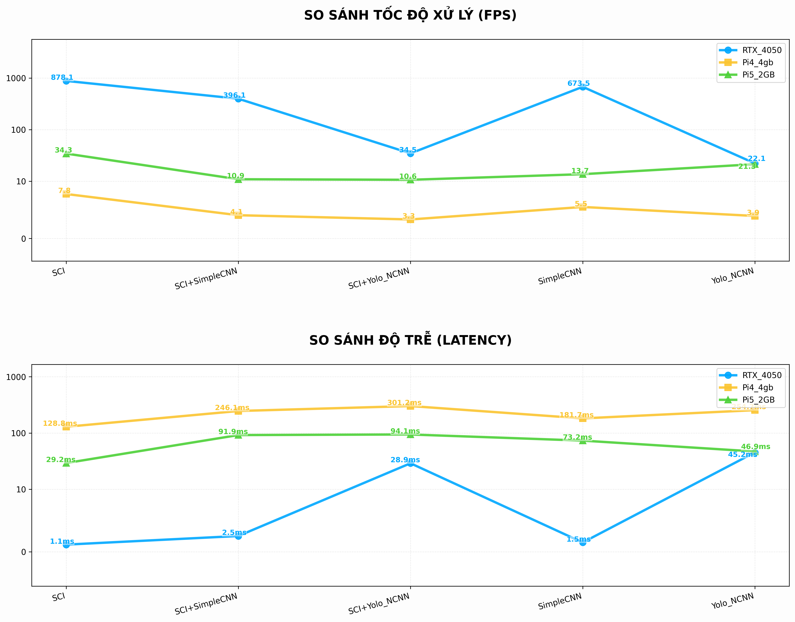
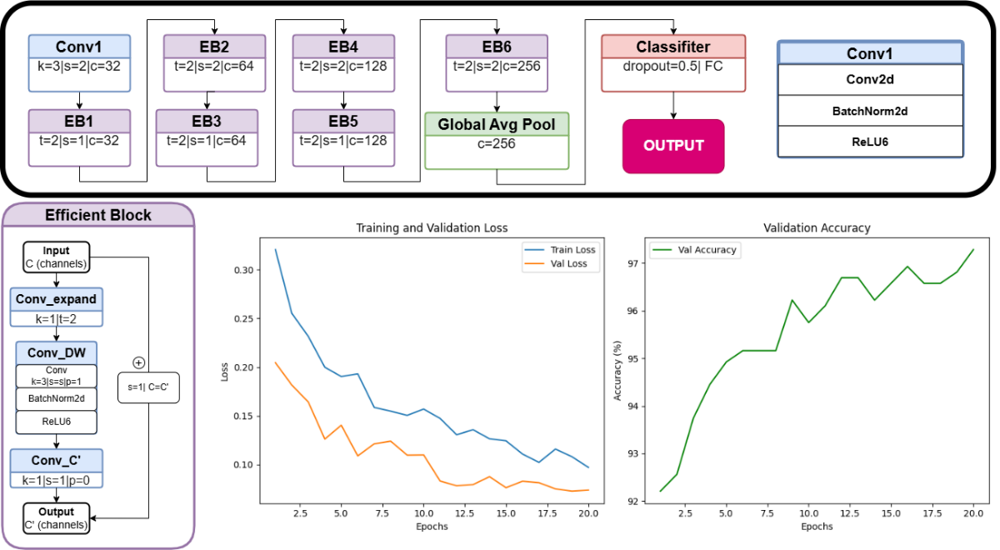

# Giới thiệu

* Ấn vào đây để xem: [Hướng dẫn chạy Code](#huong-dan)
* Ấn vào đây để xem: [Tài liệu tham khảo](#tham-khao)

# 🚦 Traffic Control System - Edge AI 🧠
`Traffic_Control` là một hệ thống điều khiển lưu lượng giao thông tự động dựa trên **Edge AI**, được thiết kế để chạy trên **Raspberry Pi 5** và giao tiếp với các bộ điều khiển ngoại vi như **ESP32**. Mục tiêu chính là giám sát trực tiếp, phân tích mật độ và điều phối tín hiệu giao thông trong thời gian thực với hiệu suất cao và tiêu thụ tài nguyên thấp.

   
  <i>Biểu đồ so sánh hiệu năng giữa RTX 4050, Pi 4 và Pi 5</i>

# Điểm nổi bật

- **Xử lý ảnh trước thông minh**: áp dụng mô hình **SCI** để cải thiện độ sáng và chất lượng ảnh đầu vào trong điều kiện ánh sáng yếu, ban đêm, hoặc ngược sáng.
- **Phân tích mật độ thông minh**: sử dụng **SimpleCNN** để đánh giá sơ bộ tình trạng giao thông, giúp tối ưu luồng xử lý trước khi vào bước nhận diện chi tiết.
- **Nhận diện phương tiện chính xác**: triển khai **YOLOv26n** trên nền tảng **NCNN** để phát hiện và phân loại các loại phương tiện.
- **Điều phối tín hiệu linh hoạt**: hệ thống hỗ trợ **4 chế độ hoạt động** và có khả năng vận hành tự động dựa trên tình trạng giao thông thực tế.
- **Thiết kế nhẹ, phù hợp nhúng**: lựa chọn kiến trúc và mô hình tối ưu để chạy hiệu quả trên Raspberry Pi 5.

---

# Kiến trúc hệ thống

Hệ thống được xây dựng theo **4 tầng xử lý tuần tự**:

## [Tầng 1: Tiền xử lý hình ảnh (Image Pre-processing Layer)](TRAM_A/tienxulyanh.py)
- Chuyển ảnh đầu vào sang định dạng phù hợp.
- Thu nhận **[ROI](TRAM_A/ROI.py)** và chuẩn hóa về kích thước **480x480**.
- Áp dụng mô hình **[SCI](TRAM_A/model_sci.py)** để cải thiện tỷ lệ tương phản, khử nhiễu và tăng độ sáng cho ảnh thiếu sáng.
- Mô-đun **Self-Calibrated Module** giúp điều chỉnh đầu ra của mô hình sao cho hội tụ tốt hơn và giữ được đặc trưng ban đầu của ảnh.

   
  <i>Model SCI</i>

## [Tầng 2: Phân tích mật độ tổng quát (Traffic Density Analysis Layer)](TRAM_A/cnn.py)
- Sử dụng mạng **SimpleEfficientCNN** để phân loại trạng thái giao thông.
- Phân tích xem vùng quan sát có đang **kẹt xe** hay **không kẹt xe**.
- Kết quả tầng này giúp hệ thống quyết định độ ưu tiên trước khi thực hiện nhận diện chi tiết.

   
  <i>Model SimpleEfficientCNN</i>

## [Tầng 3: Nhận diện và phân loại chi tiết (Object Detection Layer)](TRAM_A/yolov26.py)
- Triển khai **YOLOv26n** để phát hiện phương tiện.
- Chạy trên khung **NCNN** để tối ưu hiệu suất trên nền Raspberry Pi.
- Kết quả phát hiện được chuyển tiếp thành **thông tin chế độ** (mode) cho tầng điều phối.

   
  <i>Model Yolov26</i>

   
  <i>Train Yolov26</i>

## [Tầng 4: Điều phối và thi hành (Traffic Control & Execution Layer)](TRAM_A/logic_2.py)
- Raspberry Pi 5 điều khiển luồng logic và gửi lệnh ra thiết bị ngoại vi.
- Hỗ trợ **4 chế độ hoạt động**, trong đó có chế độ **Auto** để tự động điều chỉnh tín hiệu.
- Thông tin đầu ra gồm: trạng thái giao thông, chế độ điều khiển, và lệnh thực thi cho ESP32 hoặc thiết bị led/tín hiệu.

   
  <i>Logic ESP32</i>

---

# Mô hình và công nghệ sử dụng

- **SCI**: Mô hình xử lý ảnh thiếu sáng giúp cải thiện độ sáng và chi tiết ảnh trước khi phân tích.
- **SimpleEfficientCNN**: Mạng nhẹ dùng để phân tích khái quát mật độ giao thông.
- **YOLOv26n**: Mô hình nhận diện đối tượng nhanh, phù hợp với nền tảng nhúng.
- **NCNN**: Framework tối ưu cho inference trên thiết bị Edge như Raspberry Pi.
- **Raspberry Pi 5**: Thiết bị xử lý chính.
- **ESP32**: Thiết bị nhận lệnh và điều khiển tín hiệu/đèn giao thông.

---

# Hướng dẫn 🚀

## Raspberry Pi 5 🍓
#### B1 [Setup-Enviroment](Enviroment.text)
+       Python 3.10.11
+       Thư viện cần thiết ( bản lite dành cho edge)

#### B2 [Chạy mô hình](TRAM_A\app.py)
- Chạy `app.py` hoặc phiên bản tương ứng trong `TRAM_A/`hoặc `TRAM_B/`
- Đảm bảo camera, wifi đã được kết nối
- VD: 
-       cd Traffic_Control
        source yolo/bin/activate
        cd TRAM_A
        python app.py

## Laptop/PC 💻
####  [Tải code.zip](https://github.com/TanNguyen285/Traffic_Control/tree/PC)
+       Giải nén zip -> Chọn Setup_TrafficAI_Final.exe
+       Click chuột phải -> Run as administrator -> Đợi tải thư viện (5-10p)

# 📊 Đánh giá trên benchmark
- Dùng script trong [Service_Pi5](Service_Pi5/benchmark/chart_pro) để đánh giá hiệu suất.
- Chạy [Benchmark từng model](Service_Pi5/benchmark/benchmark_single.py) hoặc [Benchmark gộp model](Service_Pi5/benchmark/benchmark_dup.py) để ghi nhận tốc độ inference.

---

## Gợi ý nâng cao

- Cập nhật mô hình `YOLOv26n` và `SimpleCNN` với dữ liệu thực tế của địa điểm triển khai.
- Điều chỉnh ROI và logic điều khiển tín hiệu để phù hợp với từng giao lộ.
- Kết hợp thêm dữ liệu cảm biến ngoài như nhiệt độ, tốc độ gió, hoặc trạng thái đèn giao thông hiện tại.

---

## 📄 Tài liệu tham khảo

- SCI_Github: https://github.com/vis-opt-group/SCI
- NCNN_Github: https://github.com/Tencent/ncnn
- YOLO_Github: https://github.com/ultralytics/ultralytics/blob/main/ultralytics/cfg/models/26/yolo26.yaml
- [Paper_SimpleEfficientCNN](https://www.bing.com/ck/a?!&&p=27ace28f3384660ef6d080beff5895e049ca6263ec656829e27dbebe57e7930bJmltdHM9MTc3NDMxMDQwMA&ptn=3&ver=2&hsh=4&fclid=298b2b10-5c29-635c-2aa8-3c075d0462ea&psq=SimpleEfficientCNN%3a+A+Lightweight+and+Efficient+Deep+Learning+Framework+for+High-Precision+Rice+Seed+Classification&u=a1aHR0cHM6Ly93d3cubWRwaS5jb20vMjA3Ny0wNDcyLzE2LzMvMzU3)
- [Yolov26-Overview](https://docs.ultralytics.com/vi/models/yolo26/#)
- [Paper_SCI](https://openaccess.thecvf.com/content/CVPR2022/html/Ma_Toward_Fast_Flexible_and_Robust_Low-Light_Image_Enhancement_CVPR_2022_paper.html)
- [Paper_Yolov26](https://arxiv.org/abs/2509.25164)
---

## Ghi chú

Tài liệu này được soạn lại dựa trên cấu trúc hiện có của repository và sơ đồ thiết kế [Paper A3](<draw/Paper A3.drawio>)
