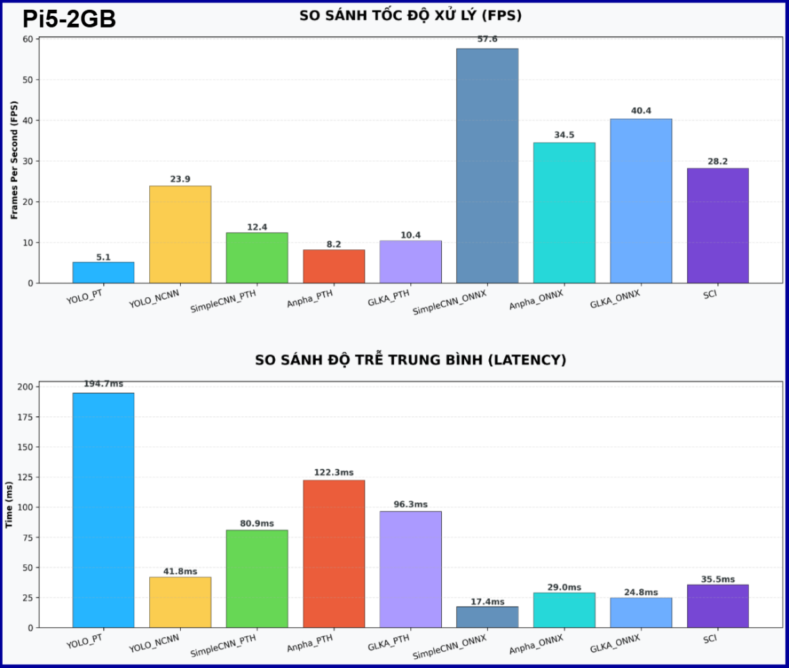
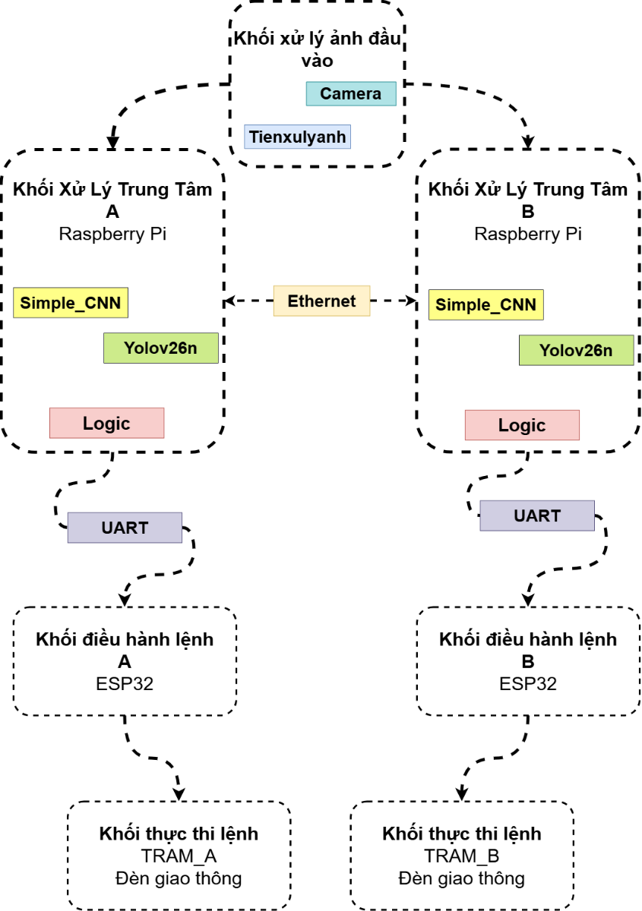
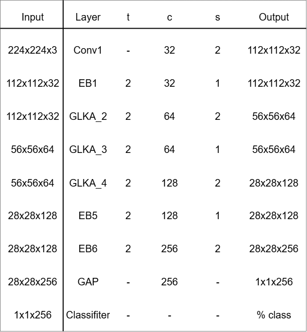
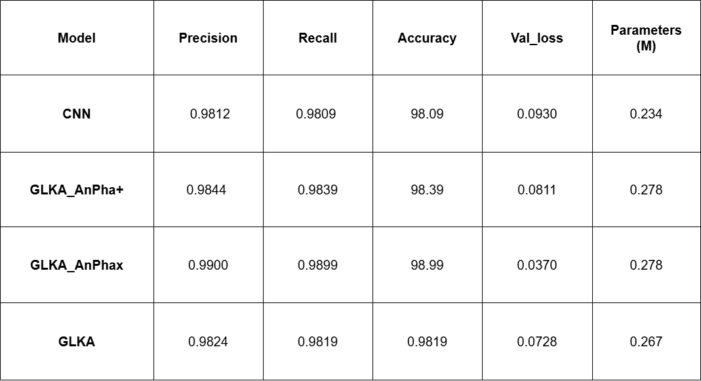
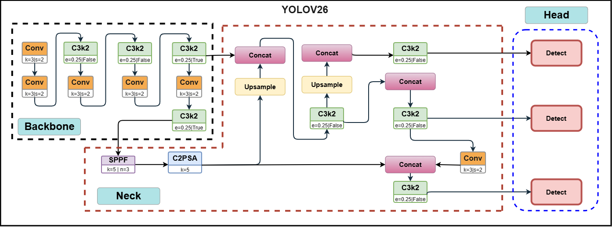
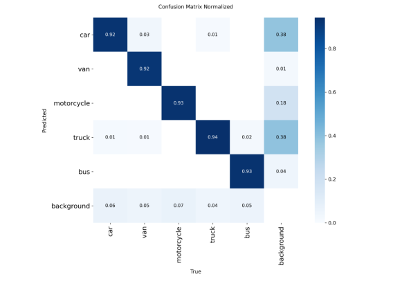
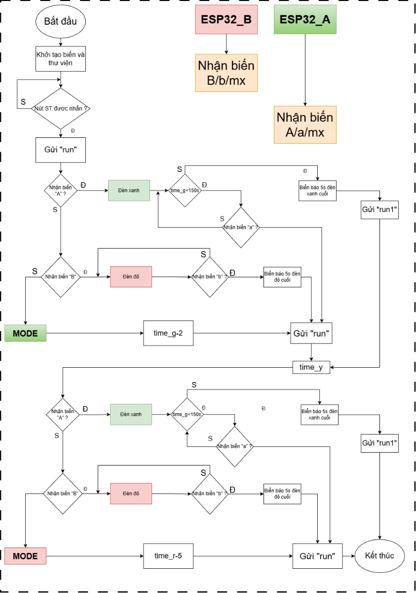

# Mục lục

- [Tổng quan](#tổng-quan)
- [Hướng dẫn triển khai](#hướng-dẫn-triển-khai)
- [Tài liệu tham khảo](#tài-liệu-tham-khảo)

---

# Tổng quan

## Traffic Control System - Edge AI

`Traffic_Control` là một hệ thống quản lý giao thông thông minh dựa trên công nghệ Edge AI, được tối ưu hóa để triển khai trên **Raspberry Pi 5** với khả năng giao tiếp với các thiết bị điều khiển ngoại vi như **ESP32**. Hệ thống cung cấp các tính năng giám sát thời gian thực, phân tích mật độ giao thông và điều phối tín hiệu giao thông một cách hiệu quả với mức tiêu thụ tài nguyên tối thiểu.
<p align="center">
  <br>
  <em>Hình 1: Biểu đồ so sánh hiệu năng xử lý giữa RTX 4050, Raspberry Pi 4 và Raspberry Pi 5</em>
</p>

---

## Các tính năng chính

- **Tiền xử lý hình ảnh thông minh**: Áp dụng mô hình SCI nhằm tối ưu hóa độ sáng, cải thiện chất lượng ảnh trong các điều kiện ánh sáng bất lợi, bao gồm các tình huống ban đêm hoặc có hiện tượng ngược sáng.

- **Phân tích mật độ giao thông**: Sử dụng mạng SimpleCNN để đánh giá tình trạng giao thông ở mức tổng quát, giúp tối ưu hóa luồng xử lý trước khi thực hiện nhận diện chi tiết.

- **Phát hiện và phân loại phương tiện**: Triển khai mô hình YOLOv26n trên khung NCNN để phát hiện và phân loại các loại phương tiện một cách chính xác.

- **Điều phối tín hiệu giao thông**: Hệ thống hỗ trợ 4 chế độ hoạt động khác nhau, bao gồm chế độ tự động để điều chỉnh tín hiệu dựa trên tình trạng giao thông thực tế.

- **Tối ưu hóa cho thiết bị nhúng**: Các mô hình và kiến trúc được lựa chọn và tối ưu hóa để hoạt động hiệu quả trên Raspberry Pi 5 với hiệu năng cao và tiêu thụ năng lượng thấp.

---

## Kiến trúc hệ thống


<p align="center">
  <br>
  <em>Tổng quát mô hình</em>
</p>

Hệ thống được thiết kế theo mô hình xử lý tuần tự gồm 4 tầng (layers), mỗi tầng thực hiện các chức năng riêng biệt:

### Tầng 1: Tiền xử lý hình ảnh
**Tệp thực thi**: [tienxulyanh.py](TRAM_A/tienxulyanh.py)

- Chuyển đổi định dạng ảnh đầu vào theo tiêu chuẩn của hệ thống.
- Thu nhận vùng quan tâm ([ROI](TRAM_A/ROI.py)) và chuẩn hóa kích thước về 480x480 pixel.
- Áp dụng mô hình [SCI](TRAM_A/model_sci.py) để cải thiện độ tương phản, giảm nhiễu và tăng độ sáng cho các ảnh có ánh sáng yếu.
- Sử dụng Self-Calibrated Module để tinh chỉnh đầu ra mô hình, đảm bảo hội tụ tốt hơn và bảo tồn đặc trưng ban đầu của ảnh.
<p align="center">
  <br>
  <em>Hình 2: Kiến trúc mô hình SCI</em>
</p>

### Tầng 2: Phân tích mật độ giao thông
**Tệp thực thi**: [cnn.py](TRAM_A/cnn.py)

- Sử dụng mạng nơ-ron Simple_GLKA để phân loại tình trạng giao thông tại vùng quan sát.
- Xác định xem vùng quan sát đang ở trạng thái "kẹt xe" hay "không kẹt xe".
- Kết quả từ tầng này giúp hệ thống xác định độ ưu tiên xử lý trước khi thực hiện nhận diện chi tiết.
<p align="center">
  
  &nbsp;&nbsp;&nbsp;&nbsp;
  
  <br>
  <em>Hình 3: Thông số kỹ thuật của mô hình Simple_GLKA</em>
</p>

<p align="center">
  <br>
  <em>Hình 4: Kiến trúc mô hình Simple_GLKA</em>
</p>

<p align="center">
  <br>
  <em>Hình 5: Visualization Attention Map và Matrix</em>
</p>

### Tầng 3: Phát hiện và phân loại phương tiện
**Tệp thực thi**: [yolov26.py](TRAM_A/yolov26.py)

- Triển khai mô hình YOLOv26n để phát hiện các phương tiện giao thông.
- Sử dụng khung NCNN để tối ưu hóa hiệu năng inference trên nền Raspberry Pi.
- Thông tin phát hiện được truyền tới tầng điều phối dưới dạng các thông số chế độ (mode).
<p align="center">
  <br>
  <em>Hình 6: Kiến trúc mô hình YOLOv26</em>
</p>

<p align="center">
  <br>
  <em>Hình 7: Quá trình huấn luyện mô hình YOLOv26</em>
</p>

### Tầng 4: Điều phối tín hiệu giao thông
**Tệp thực thi**: [logic_2.py](TRAM_A/logic_2.py)

- Raspberry Pi 5 thực hiện quản lý luồng xử lý logic và phát hành lệnh điều khiển tới các thiết bị ngoại vi.
- Hệ thống hỗ trợ 4 chế độ hoạt động khác nhau, trong đó có chế độ tự động (Auto) để tự động điều chỉnh tín hiệu giao thông.
- Thông tin đầu ra bao gồm: trạng thái giao thông, chế độ hoạt động hiện tại, và các lệnh thực thi gửi tới ESP32 hoặc các thiết bị LED/tín hiệu.
  
<p align="center">
  <br>
  <em>Hình 8: Sơ đồ logic điều khiển ESP32</em>
</p>

---

## Mô hình và công nghệ sử dụng

| Thành phần | Mô tả | Mục đích |
|-----------|-------|---------|
| **SCI** | Mô hình xử lý ảnh với khả năng cải thiện độ sáng | Cải thiện chất lượng ảnh trong điều kiện ánh sáng yếu |
| **SimpleEfficientCNN** | Mạng nơ-ron tích chập nhẹ | Phân tích nhanh mật độ giao thông tổng quát |
| **YOLOv26n** | Mô hình nhận diện đối tượng cải tiến | Phát hiện và phân loại phương tiện chính xác |
| **NCNN** | Framework inference tối ưu | Xử lý mô hình trên thiết bị Edge hiệu quả |
| **Raspberry Pi 5** | Máy tính nhúng | Xử lý chính và quản lý luồng logic |
| **ESP32** | Vi điều khiển | Điều khiển tín hiệu và thiết bị LED giao thông |

---

# Hướng dẫn triển khai

## Triển khai trên Raspberry Pi 5

### Bước 1: Thiết lập môi trường
**Tệp tham khảo**: [Enviroment.text](Enviroment.text)

- Yêu cầu Python 3.10.11 trở lên
- Cài đặt các thư viện phụ thuộc (phiên bản tối ưu cho thiết bị nhúng)

### Bước 2: Chạy ứng dụng chính
**Tệp thực thi**: [app.py](TRAM_A/app.py)

- Chạy tệp `app.py` hoặc phiên bản tương ứng trong `TRAM_A/` hoặc `TRAM_B/`
- Đảm bảo camera và kết nối WiFi đã được cấu hình đúng
- Ví dụ lệnh chạy:

```bash
cd Traffic_Control
source venv/bin/activate
cd TRAM_A
python app.py
```

## Triển khai trên Laptop/PC

### Cài đặt ứng dụng

1. Tải tệp từ nhánh PC: [Code.zip](https://github.com/TanNguyen285/Traffic_Control/tree/PC)
2. Giải nén tệp zip
3. Chạy file `Setup_TrafficAI_Final.exe`
4. Nhấp chuột phải và chọn "Run as Administrator"
5. Chờ quá trình cài đặt thư viện hoàn tất (khoảng 5-10 phút)


---

## Đánh giá hiệu năng (Benchmarking)

Hệ thống cung cấp các công cụ để đánh giá hiệu năng xử lý:

- **Benchmark từng mô hình**: Sử dụng script [benchmark_single.py](benchmark/benchmark_single.py) để đo tốc độ inference của từng mô hình riêng biệt.

- **Benchmark toàn bộ quy trình**: Sử dụng script [benchmark_dup.py](benchmark/benchmark_dup.py) để ghi nhận tốc độ xử lý toàn bộ luồng dữ liệu.

- **Công cụ trực quan hóa**: Sử dụng [chart_pro.py](benchmark/chart_pro.py) để tạo biểu đồ so sánh hiệu năng.

---

## Hướng dẫn nâng cao

Để tối ưu hóa hiệu suất hệ thống cho các trường hợp sử dụng cụ thể:

1. **Cập nhật dữ liệu huấn luyện**: Cập nhật mô hình YOLOv26n và SimpleCNN với dữ liệu thực tế từ điểm triển khai cụ thể để cải thiện độ chính xác nhận diện.

2. **Điều chỉnh ROI và logic điều khiển**: Tinh chỉnh vùng quan tâm (ROI) và các quy tắc logic điều phối tín hiệu để phù hợp với cấu trúc giao lộ cụ thể.

3. **Tích hợp cảm biến bổ sung**: Kết hợp dữ liệu từ các cảm biến ngoài như nhiệt độ môi trường, tốc độ gió, hoặc trạng thái tín hiệu giao thông hiện tại để cải thiện độ chính xác của hệ thống.

---

<div id="tài-liệu-tham-khảo"></div>

# Tài liệu tham khảo

## Repository và Framework

- **SCI GitHub**: https://github.com/vis-opt-group/SCI
- **NCNN GitHub**: https://github.com/Tencent/ncnn
- **YOLO GitHub**: https://github.com/ultralytics/ultralytics/blob/main/ultralytics/cfg/models/26/yolo26.yaml

## Bài báo khoa học và Lý thuyết Nền tảng

### 1. SimpleEfficientCNN: Mạng Tối giản và Hiệu quả
**Tài liệu**: [SimpleEfficientCNN: A Lightweight and Efficient Deep Learning Framework for High-Precision Rice Seed Classification](https://www.mdpi.com/2077-0472/16/3/357)

**Khái niệm chính**: SimpleEfficientCNN là một mạng tích chập siêu nhẹ được tối ưu hóa đặc biệt cho các bài toán phân loại với độ chính xác cao nhưng tiêu tốn cực ít tài nguyên tính toán.

**Triết lý thiết kế**:
- **Tối giản hóa cấu trúc**: Sử dụng tỷ lệ mở rộng t=2 (thay vì t=6 như MobileNetV2) để giảm thiểu sự dư thừa tham số
- **Loại bỏ chú ý (Attention-free)**: Bỏ qua các khối chú ý để đạt tốc độ suy luận tối đa trên thiết bị cạnh
- **Tăng trưởng kênh ổn định**: Chuỗi mở rộng kênh (32 → 64 → 128 → 256) giúp triển khai phần cứng thân thiện
- **Hiệu quả thực nghiệm**: Đạt độ chính xác tương đương ResNet34 nhưng với tham số ít hơn 92 lần và bộ nhớ GPU chỉ ~20.5 MB

---

### 2. Batch Normalization: Ổn định hóa và Tăc tốc Huấn luyện
**Tài liệu**: [Batch Normalization: Accelerating Deep Network Training by Reducing Internal Covariate Shift](https://arxiv.org/abs/1502.03167)

**Khái niệm chính**: Kỹ thuật chuẩn hóa đầu vào của mỗi tầng thần kinh theo từng lô (batch) dữ liệu để giải quyết vấn đề "Internal Covariate Shift".

**Triết lý thiết kế**:
- **Ổn định hóa Gradient**: Điều chỉnh phân phối đầu vào về mức trung bình 0 và phương sai 1, ngăn chặn gradient biến mất hoặc bùng nổ
- **Tăc tốc hội tụ**: Cho phép sử dụng learning rate cao hơn mà vẫn ổn định, rút ngắn thời gian huấn luyện
- **Hiệu ứng điều tiết**: Có tác động điều tiết nhẹ, giúp giảm sự phụ thuộc vào Dropout

---

### 3. Squeeze-and-Excitation Networks: Cơ chế Chú ý Trên Kênh
**Tài liệu**: [Squeeze-and-Excitation Networks](https://arxiv.org/abs/1709.01507)

**Khái niệm chính**: Cơ chế chú ý tập trung vào mối quan hệ giữa các kênh (channels) để hiệu chỉnh đặc trưng một cách thích nghi.

**Quy trình xử lý**:
1. **Squeeze**: Nén thông tin không gian toàn cục vào mô tả kênh thông qua Global Average Pooling
2. **Excitation**: Sử dụng FC layers + Sigmoid để tạo trọng số cho từng kênh
3. **Scaling**: Nhân các bản đồ đặc trưng đầu vào với trọng số kênh

---

### 4. Dilated Convolutions: Tích chập Giãn
**Tài liệu**: [Multi-Scale Context Aggregation by Dilated Convolutions](https://arxiv.org/abs/1511.07122)

**Khái niệm chính**: Cho phép mở rộng vùng tiếp nhận theo hàm số mũ mà không làm mất độ phân giải của bản đồ đặc trưng.

**Ứng dụng**:
- Trong các bài toán dự đoán dày đặc (phân đoạn ảnh), Pooling làm giảm độ phân giải không gian
- Tích chập giãn hỗ trợ thu thập ngữ cảnh đa quy mô bằng cách áp dụng bộ lọc tại các điểm cách quãng nhau

---

### 5. Large Kernel Attention (LKA) - Visual Attention Network
**Tài liệu**: [Visual Attention Network](https://arxiv.org/abs/2202.09741)

**Khái niệm chính**: Cơ chế chú ý tuyến tính mới, kết hợp ưu điểm của tích chập (thông tin cấu trúc cục bộ) và self-attention (quan hệ tầm xa).

**Triết lý thiết kế**:
- Khắc phục nhược điểm của self-attention (độ phức tạp O(n²), bỏ qua cấu trúc 2D) và tích chập tiêu chuẩn (trọng số tĩnh)
- **Phân rã nhân lớn**: Chia tích chập K×K thành ba thành phần:
  - Tích chập cục bộ (DW-Conv)
  - Tích chập tầm xa giãn (DW-D-Conv)
  - Tích chập điểm (1×1 Conv)

---

### 6. UniRepLKNet: Mạng Tích chập Nhân Lớn
**Tài liệu**: [UniRepLKNet: A Universal Perception Large-Kernel ConvNet for Audio, Video, Point Cloud, Time-Series and Image Recognition](https://arxiv.org/abs/2311.15599)

**Khái niệm chính**: Khai thác sức mạnh của các nhân tích chập cực lớn để đạt được vùng tiếp nhận hiệu dụng (ERF) rộng lớn mà không cần mạng quá sâu.

**Triết lý thiết kế**:
- **"Nhìn rộng mà không cần sâu"**: Sử dụng vài lớp nhân lớn ở tầng giữa/cao thay vì hàng chục lớp nhân 3×3
- **Tách biệt các tác động**: Tách mở rộng ERF (nhân lớn), tăng phân cấp trừu tượng (nhân nhỏ), tăng khả năng biểu diễn (độ sâu)
- **Tái tham số hóa**: Sử dụng nhánh tích chập giãn nhỏ trong huấn luyện, hợp nhất thành nhân lớn duy nhất trong suy luận

---

### 7. SCI: Cải thiện Ảnh Ánh sáng Yếu
**Tài liệu**: [Toward Fast, Flexible, and Robust Low-Light Image Enhancement (CVPR 2022)](https://openaccess.thecvf.com/content/CVPR2022/html/Ma_Toward_Fast_Flexible_and_Robust_Low-Light_Image_Enhancement_CVPR_2022_paper.html)

**Khái niệm chính**: Mô hình cải thiện chất lượng ảnh trong điều kiện ánh sáng yếu, ban đêm hoặc ngược sáng.

---

### 8. YOLOv26: Nhận diện Đối tượng Cải tiến
**Tài liệu**: 
- [YOLOv26 - Overview](https://docs.ultralytics.com/vi/models/yolo26/#)
- [YOLOv26 Paper](https://arxiv.org/abs/2509.25164)

**Khái niệm chính**: Phiên bản cải tiến của YOLO với khả năng phát hiện và phân loại phương tiện chính xác, phù hợp với triển khai trên thiết bị nhúng.

---

## Ghi chú

Tài liệu này được biên soạn dựa trên cấu trúc hiện tại của repository và sơ đồ thiết kế kiến trúc trong tệp [Paper A3.drawio](draw/Paper%20A3.drawio)
