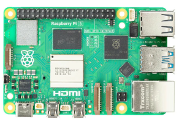
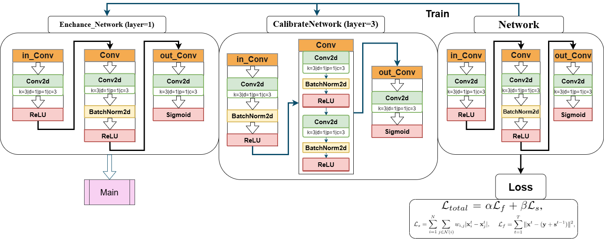
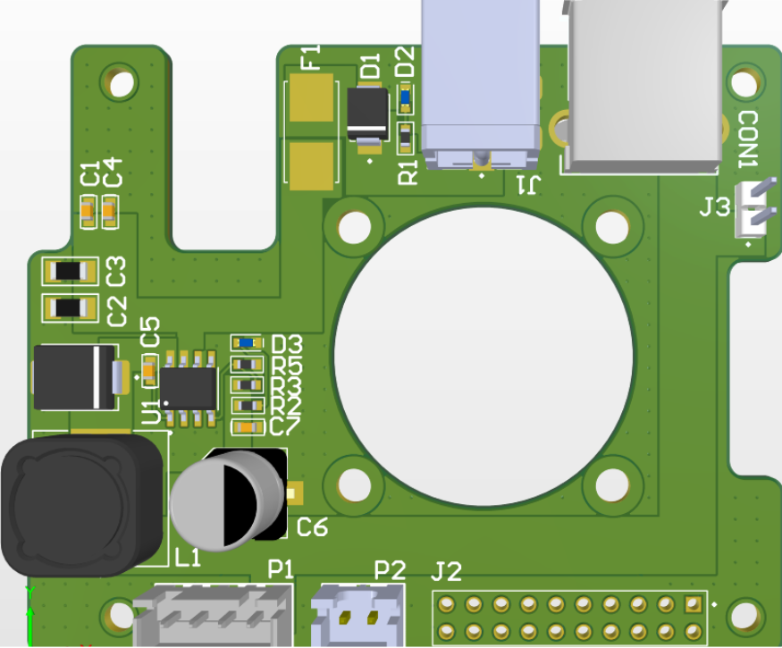
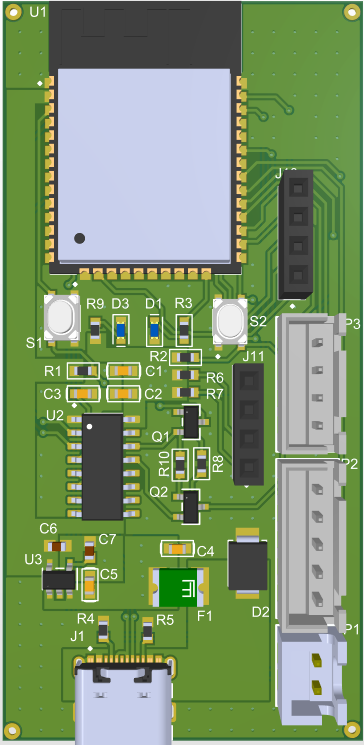

# 🚦 Traffic Control System  
## Edge AI-based Solution for Real-Time Traffic Management on Raspberry Pi 5

---

# 🚀 Key Highlights

## 🌙 Low-Light   
Tích hợp [**AI-SCI**](https://openaccess.thecvf.com/content/CVPR2022/html/Ma_Toward_Fast_Flexible_and_Robust_Low-Light_Image_Enhancement_CVPR_2022_paper.html) giúp hệ thống duy trì độ chính xác cao trong điều kiện ánh sáng yếu, ban đêm hoặc ngược sáng.

Source : 

      Github:https://github.com/vis-opt-group/SCI

## ⚡ High Performance  
YOLOv26n được tối ưu hóa trên Raspberry Pi 5, hệ thống đạt khả năng xử lý Real-Time nhờ framework [**NCNN**](https://docs.ultralytics.com/vi/integrations/ncnn/#key-features-of-ncnn-models)

Source : 

      Github:https://github.com/Tencent/ncnn
## 🪶 Ultra-Lightweight  
Sử dụng kiến trúc [**SimpleEfficientCNN**](https://www.mdpi.com/2077-0472/16/3/357) (*0.251M parameters*) cho phép phân tích mật độ giao thông hiệu quả mà không tiêu tốn nhiều tài nguyên.

---

# 🏗 System Architecture

Hệ thống được thiết kế theo **Sequential Pipeline gồm 4 tầng chính**:

## 1. 🖼 Image Pre-processing  
- Khử nhiễu và cân bằng ánh sáng  
- Sử dụng mạng **SCI (Weight Sharing)** để tối ưu hiệu suất xử lý
-

  

## 2. 📊 Density Analysis  
- Áp dụng **SimpleCNN** trên vùng ROI *(224x224)*  
- Đánh giá sơ bộ mức độ ùn tắc giao thông

  

## 3. 🚗 Object Detection  
- Triển khai **YOLOv26n**   
- Nhận diện chính xác nhiều loại phương tiện

  

## 4. 🚦 Control Logic  
- Điều phối đèn tín hiệu giao thông thông minh  
<table border="0">
  <tr>
    <td align="center">
      
       
      Raspberry Pi Model
    </td>
    <td align="center">
      
       
      ESP32 Module
    </td>
  </tr>
</table>

# 🧠 Tổng Quan

Traffic_Control là một giải pháp **Edge AI hoàn chỉnh**, kết hợp giữa **xử lý ảnh nâng cao**, **phân tích mật độ**, và **nhận diện đối tượng** nhằm tối ưu hóa điều phối giao thông trong thời gian thực — đặc biệt phù hợp với các hệ thống nhúng chi phí thấp.

---
