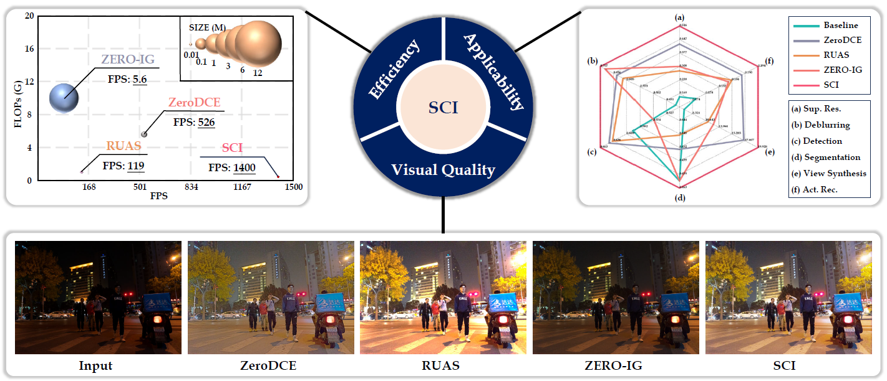
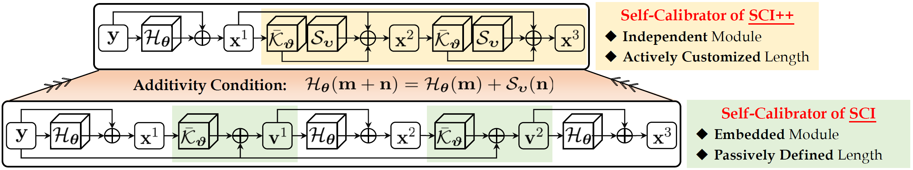
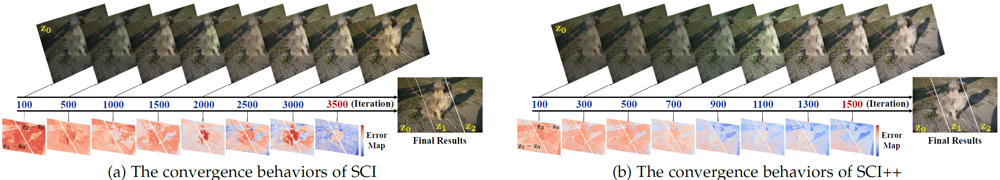
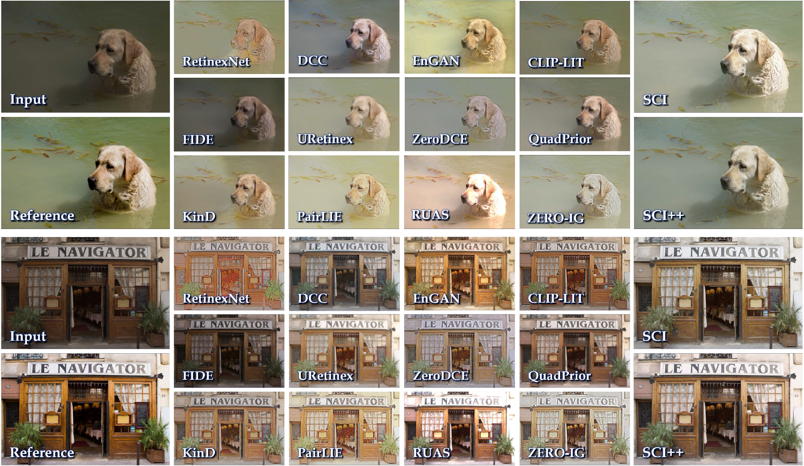
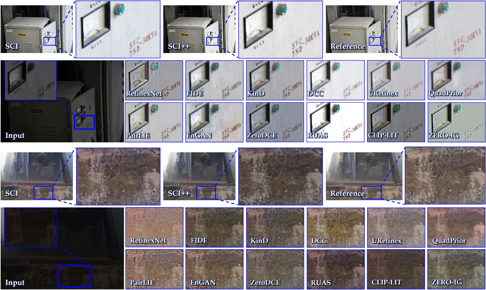
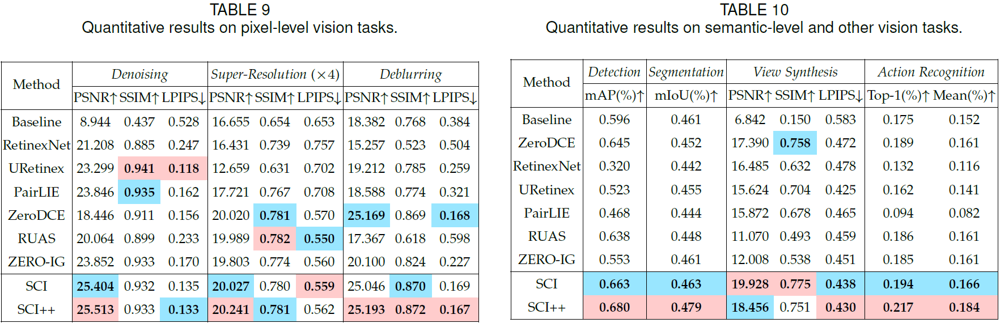
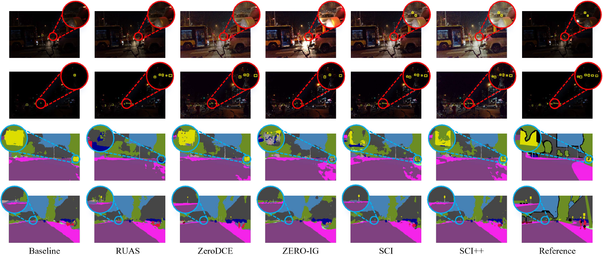
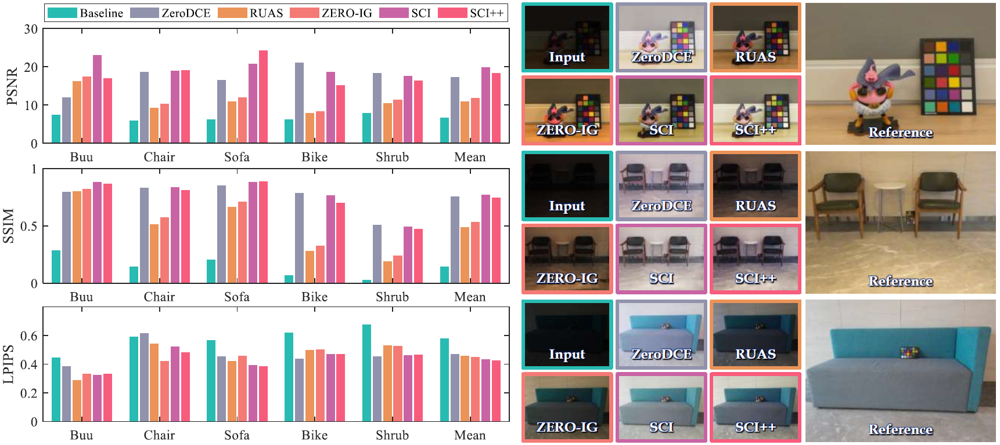

# [TPAMI 2025] Learning with Self-Calibrator forFast and Robust Low-Light Image Enhancement [[Paper](https://ieeexplore.ieee.org/document/11072373)]

# [CVPR 2022 (Oral)] Toward Fast, Flexible, and Robust Low-Light Image Enhancement [[Paper](https://openaccess.thecvf.com/content/CVPR2022/html/Ma_Toward_Fast_Flexible_and_Robust_Low-Light_Image_Enhancement_CVPR_2022_paper.html)]


 
<p style="text-align:justify">Convolutional Neural Networks (CNNs) have shown significant success in the low-light image enhancement task. However, most of existing works encounter challenges in balancing quality and efficiency simultaneously. This limitation hinders practical applicability in real-world scenarios and downstream vision tasks. To overcome these obstacles, we propose a Self-Calibrated Illumination (SCI) learning scheme, introducing a new perspective to boost the model’s capability. Based on a weight-sharing illumination estimation process, we construct an embedded self-calibrator to accelerate stage-level convergence, yielding gains that utilize only a single basic block for inference, which drastically diminishes computation cost. Additionally, by introducing the additivity condition on the basic block, we acquire a reinforced version dubbed SCI++, which disentangles the relationship between the self-calibrator and illumination estimator, providing a more interpretable and effective learning paradigm with faster convergence and better stability. We assess the proposed enhancers on standard benchmarks and in-the-wild datasets, confirming that they can restore clean images from diverse scenes with higher quality and efficiency. The verification on different levels of low-light vision tasks shows our applicability against other methods..</p>


## Self-Calibrated Illumination (SCI) Learning Framework
 
<p style="text-align:justify">The entire framework of SCI. In the training phase, our SCI is composed of the illumination estimation and self-calibrated module. The self-calibrated module map is added to the original low-light input as the input of the illumination estimation at the next stage. Note that these two modules are respectively shared parameters in the whole training procedure. In the testing phase, we just utilize a single illumination estimation module.</p>


## Additivity condition into the illumination estimator (SCI++)
 
<p style="text-align:justify"> Comparing the flowchart between the original method (i.e., SCI) and its reinforced version (i.e., SCI++). By enforcing the additivity condition into the illumination estimator, the self-calibrator undergoes a transition from being embedded to becoming independent and gains the advantage of active customized length for self-calibrator.</p>
 
<p style="text-align:justify"> Comparing convergence behaviors between SCI and SCI++.</p>

## Experiments

### Dataset used in the paper
[[MIT](https://drive.google.com/file/d/1KKB0ruBN12-vr-4upz8ZXKTsE3yHnt2V/view?usp=sharing)]: This paper randomly selected 500 image pairs and 100 image pairs from the MIT dataset for training and testing, respetively. Details about the RAW2RGB conversion process and the complete MIT dataset information could be obtained from [the official website](https://data.csail.mit.edu/graphics/fivek/).

[[LSRW](https://drive.google.com/file/d/1feX1yZwRtKv3kJwpGyBT1CtOjH9rrTg2/view?usp=sharing)]: This paper randomly selected 500 image pairs and 50 image pairs from the LSRW dataset for training and testing, respetively. The complete LSRW dataset information could be obtained from [the official website](https://drive.google.com/file/d/1X1uuH5gqmGua2AnN4BsC8YI-H7mJ1Dji/view?usp=sharing).

[[Comparison Result](https://drive.google.com/drive/folders/1c69IcvQS-Rzqn8EP_RAJA7BvRU-uT6Yx?usp=sharing)]: You can download the results of our method and the comparison methods from Google Drive.

## Results on Low-light Image Enhancement
 
 

## Results on Downstream Tasks

### Quantitative results


### Detection & Segmentation
 

### New Perspective Generation
 


## Citation
```bibtex
@ARTICLE{11072373,
  author={Ma, Long and Ma, Tengyu and Xu, Chengpei and Liu, Jinyuan and Fan, Xin and Luo, Zhongxuan and Liu, Risheng},
  journal={IEEE Transactions on Pattern Analysis and Machine Intelligence}, 
  title={Learning With Self-Calibrator for Fast and Robust Low-Light Image Enhancement}, 
  year={2025},
  volume={47},
  number={10},
  pages={9095-9112}
}

@inproceedings{ma2022toward,
  title={Toward Fast, Flexible, and Robust Low-Light Image Enhancement},
  author={Ma, Long and Ma, Tengyu and Liu, Risheng and Fan, Xin and Luo, Zhongxuan},
  booktitle={Proceedings of the IEEE/CVF Conference on Computer Vision and Pattern Recognition},
  pages={5637--5646},
  year={2022}
}
```


